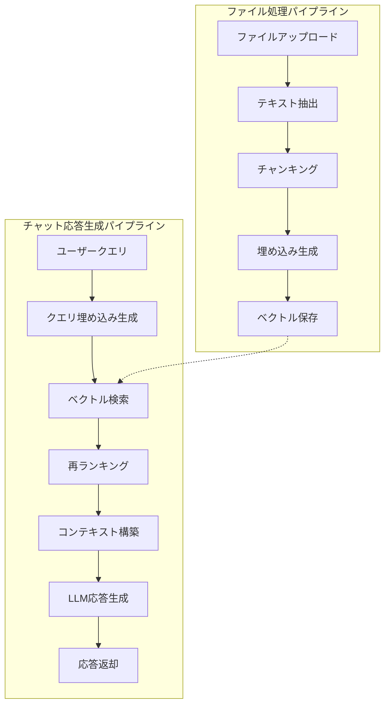

# RAGパイプライン詳細

本ドキュメントでは、RAG（Retrieval-Augmented Generation）パイプラインの詳細な仕組みを説明します。

## 目次

- [RAGパイプライン概要](#ragパイプライン概要)
- [ファイル処理パイプライン](#ファイル処理パイプライン)
- [チャット応答生成パイプライン](#チャット応答生成パイプライン)
- [コンポーネント詳細](#コンポーネント詳細)
- [パラメータ設定](#パラメータ設定)
- [パフォーマンス最適化](#パフォーマンス最適化)

---

## RAGパイプライン概要

RAGパイプラインは、以下の2つの主要なプロセスで構成されています：

1. **ファイル処理パイプライン**: アップロードされたファイルを処理し、ベクトル化して保存
2. **チャット応答生成パイプライン**: ユーザーの質問に対して、関連文書を検索し、LLMで応答を生成

### 全体フロー



---

## ファイル処理パイプライン

### 処理フロー


### ステップ詳細

#### 1. ファイルアップロード

- **エンドポイント**: `POST /api/v1/contents/upload`
- **処理内容**:
  - ファイルをストレージに保存
  - ファイル情報をデータベースに保存
  - ステータスを `PENDING` に設定
  - バックグラウンドタスクで処理を開始

#### 2. テキスト抽出

- **対応ファイル形式**:
  - PDF: `PyPDF2` を使用
  - TXT: 直接読み込み
  - DOCX: `python-docx` を使用
  - その他: 将来拡張予定

- **処理内容**:
  - ファイル形式に応じたテキスト抽出ライブラリを使用
  - エラーハンドリング: 抽出失敗時は `FAILED` ステータスに設定

#### 3. チャンキング

- **方法**: 固定サイズチャンキング + オーバーラップ
- **パラメータ**:
  - `chunk_size`: デフォルト 1024 文字
  - `chunk_overlap`: デフォルト 200 文字

- **処理内容**:
  - テキストを指定サイズで分割
  - オーバーラップを設定して文脈を保持
  - チャンクごとにメタデータ（ファイル名、チャンクインデックス等）を付与

#### 4. 埋め込み生成

- **プロバイダー**: OpenAI（デフォルト）
- **モデル**: `text-embedding-3-small` または `text-embedding-ada-002`
- **次元数**: 1536次元（`text-embedding-3-small`）または 1536次元（`text-embedding-ada-002`）

- **処理内容**:
  - 各チャンクのテキストから埋め込みベクトルを生成
  - テナント設定から埋め込みモデルを取得
  - APIキーはテナント単位で管理
  - リトライ機能（最大3回）

#### 5. ベクトル保存

- **保存先**: PostgreSQL + pgvector
- **テーブル**: `chunks`
- **カラム**:
  - `id`: チャンクID（UUID）
  - `file_id`: ファイルID
  - `tenant_id`: テナントID
  - `chunk_text`: チャンクテキスト
  - `embedding`: ベクトル（pgvector型）
  - `metadata_json`: メタデータ（JSONB）

- **インデックス**: HNSWインデックス（高速検索用）

---

## チャット応答生成パイプライン

### 処理フロー


### ステップ詳細

#### 1. 会話履歴取得

- **取得件数**: 最新10件（デフォルト）
- **用途**: コンテキスト理解、検索クエリ生成、再ランキング

#### 2. 検索クエリ生成

- **方法**: 会話履歴を考慮したクエリ生成（LLM使用）
- **プロンプト**: 現在のクエリと会話履歴から、検索に適したクエリを生成
- **目的**: より関連性の高い文書を検索するため

#### 3. クエリ埋め込み生成

- **プロバイダー**: OpenAI（デフォルト）
- **モデル**: ファイル処理と同じ埋め込みモデルを使用
- **処理**: 生成された検索クエリから埋め込みベクトルを生成

#### 4. ベクトル検索

- **方法**: PostgreSQL pgvector の L2距離（ユークリッド距離）
- **クエリ**: 
  ```sql
  SELECT id, (embedding <-> :query_embedding) AS distance
  FROM chunks
  WHERE tenant_id = :tenant_id
    AND embedding IS NOT NULL
  ORDER BY embedding <-> :query_embedding
  LIMIT :top_k
  ```

- **パラメータ**:
  - `top_k`: デフォルト 5件（リクエストで指定可能）

- **インデックス**: HNSWインデックスで高速検索

#### 5. 再ランキング

- **方法**: 会話履歴を考慮した再ランキング（LLM使用）
- **目的**: ベクトル検索の結果を、会話コンテキストに基づいて再評価
- **処理**: 各チャンクと会話履歴の関連性を評価し、スコアを再計算

#### 6. コンテキスト構築

- **方法**: 再ランキング後のチャンクを順番に結合
- **形式**: チャンクテキストを改行で区切って結合
- **ソース情報**: 各チャンクのファイル名、チャンクインデックス等を記録

#### 7. LLM応答生成

- **プロバイダー**: OpenAI, Anthropic, Google Gemini
- **モデル**: リクエストで指定（デフォルト: `gpt-4`）
- **プロンプト構成**:
  ```
  システムプロンプト: あなたは親切で正確なAIアシスタントです。
  コンテキスト: [検索されたチャンクテキスト]
  会話履歴: [過去の会話]
  ユーザークエリ: [現在の質問]
  ```

- **パラメータ**:
  - `temperature`: デフォルト 0.7
  - `max_tokens`: デフォルト 500

#### 8. 会話履歴保存

- **テーブル**: `conversations`
- **保存内容**:
  - ユーザークエリ
  - AI応答
  - 使用されたチャンクID
  - 使用トークン数
  - コスト情報

---

## コンポーネント詳細

### EmbeddingService

埋め込みベクトル生成を担当するサービス。

- **主要メソッド**:
  - `generate_embedding(text: str, tenant_id: str) -> Dict[str, Any]`
    - テキストから埋め込みベクトルを生成
    - テナント設定から埋め込みモデルを取得
    - APIキーはテナント単位で管理

- **対応プロバイダー**:
  - OpenAI: `text-embedding-3-small`, `text-embedding-ada-002`
  - その他: 将来拡張予定

### LLMService

LLM応答生成を担当するサービス。

- **主要メソッド**:
  - `generate_response(prompt: str, model: str, ...) -> Dict[str, Any]`
    - プロンプトからLLM応答を生成
    - 複数プロバイダーに対応

- **対応プロバイダー**:
  - OpenAI: `gpt-4`, `gpt-3.5-turbo`
  - Anthropic: `claude-3-opus`, `claude-3-sonnet`
  - Google: `gemini-pro`

### TextProcessor

テキスト抽出・チャンキングを担当するサービス。

- **主要メソッド**:
  - `extract_text_from_file(file_content: bytes, file_type: str) -> str`
    - ファイル形式に応じたテキスト抽出
  - `chunk_text(text: str, chunk_size: int, chunk_overlap: int) -> List[str]`
    - テキストをチャンクに分割

### VectorDBService

ベクトル検索を担当するサービス。

- **主要メソッド**:
  - `search_vector_l2(tenant_id: str, embedding: List[float], limit: int) -> Sequence[Tuple[str, float]]`
    - L2距離によるベクトル検索

- **対応プロバイダー**:
  - PostgreSQL + pgvector（デフォルト）
  - Pinecone（オプション）

### ChunkRepository

チャンクデータアクセスを担当するリポジトリ。

- **主要メソッド**:
  - `search_vector_l2(...)`: ベクトル検索
  - `search_trgm(...)`: 全文検索（pg_trgm使用）

---

## パラメータ設定

### ファイル処理パラメータ

| パラメータ | デフォルト値 | 説明 | 推奨値 |
|---|---|---|---|
| `chunk_size` | 1024 | チャンクサイズ（文字数） | 512-2048 |
| `chunk_overlap` | 200 | チャンクオーバーラップ（文字数） | 100-300 |

### チャット応答生成パラメータ

| パラメータ | デフォルト値 | 説明 | 推奨値 |
|---|---|---|---|
| `top_k` | 5 | 検索チャンク数 | 3-10 |
| `model` | `gpt-4` | LLMモデル | `gpt-4`, `claude-3-opus` |
| `temperature` | 0.7 | 温度パラメータ | 0.0-1.0 |
| `max_tokens` | 500 | 最大トークン数 | 200-1000 |

### テナント設定

テナント単位で以下の設定が可能：

- **埋め込みモデル**: OpenAI埋め込みモデルを選択
- **LLMモデル**: 使用するLLMモデルを選択
- **APIキー**: テナント専用のAI APIキーを設定

---

## パフォーマンス最適化

### インデックス最適化

- **HNSWインデックス**: ベクトル検索の高速化
  ```sql
  CREATE INDEX ON chunks USING hnsw (embedding vector_l2_ops);
  ```

- **テナントIDインデックス**: テナント分離の高速化
  ```sql
  CREATE INDEX ON chunks (tenant_id);
  ```

### キャッシュ戦略

- **埋め込みキャッシュ**: 同じテキストの埋め込みをキャッシュ（将来実装予定）
- **検索結果キャッシュ**: 頻繁に検索されるクエリの結果をキャッシュ（将来実装予定）

### 非同期処理

- **ファイル処理**: バックグラウンドタスクで非同期実行
- **埋め込み生成**: 非同期API呼び出し
- **LLM応答生成**: 非同期API呼び出し

### バッチ処理

- **埋め込み生成**: 複数チャンクをバッチで処理（将来実装予定）
- **ベクトル検索**: 複数クエリをバッチで処理（将来実装予定）

---

## エラーハンドリング

### ファイル処理エラー

- **テキスト抽出失敗**: ステータスを `FAILED` に設定、エラーメッセージを記録
- **埋め込み生成失敗**: リトライ（最大3回）、失敗時は `FAILED` に設定
- **ストレージエラー**: エラーメッセージを記録、`FAILED` に設定

### チャット応答生成エラー

- **検索結果なし**: デフォルトメッセージを返却
- **LLM APIエラー**: リトライ（最大3回）、失敗時はエラーメッセージを返却
- **埋め込み生成エラー**: リトライ（最大3回）、失敗時はエラーメッセージを返却

---

## 使用量・コスト管理

### トークン数記録

- **埋め込み生成**: `usage_logs` テーブルに記録
- **LLM応答生成**: `usage_logs` テーブルに記録

### コスト計算

- **埋め込みコスト**: プロバイダー・モデルごとの単価 × トークン数
- **LLMコスト**: プロバイダー・モデルごとの単価 × トークン数（入力 + 出力）

### 使用量統計

- **テナント単位**: 使用量統計APIで確認可能
- **期間指定**: 日次、週次、月次で集計

---

## 今後の拡張予定

- **マルチモーダル対応**: 画像、音声ファイルの処理
- **ハイブリッド検索**: ベクトル検索 + 全文検索の組み合わせ
- **リランキングモデル**: 専用リランキングモデルの使用
- **ストリーミング応答**: リアルタイムでの応答生成
- **キャッシュ機能**: 埋め込み・検索結果のキャッシュ

---

**最終更新日**: 2025-01-XX

