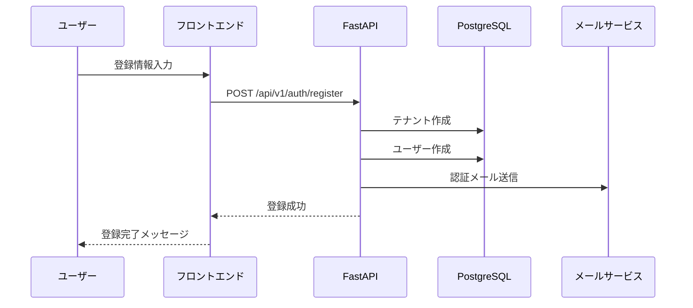
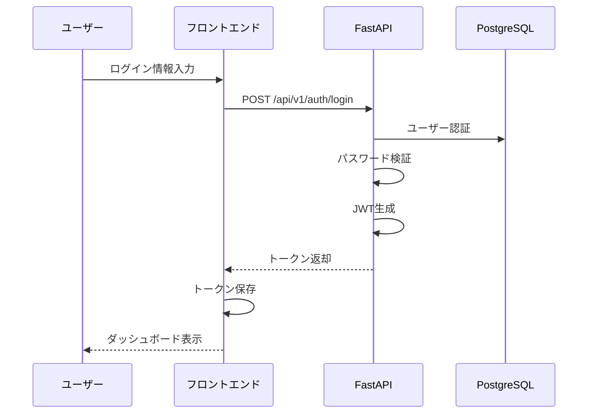
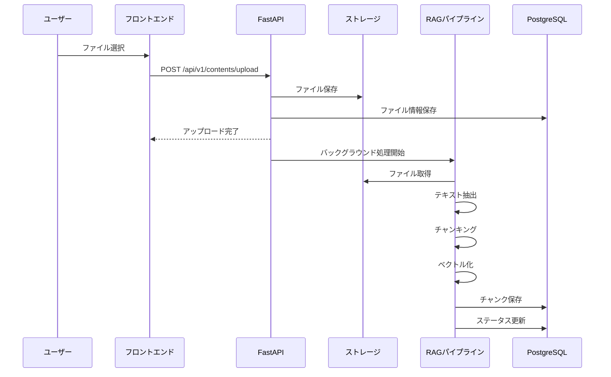
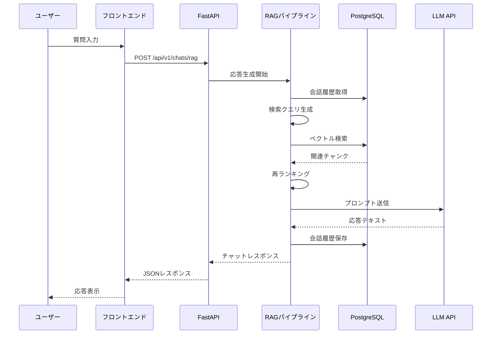

# システム設計書

## 1. 概要

### 1.1 システム構成
- **アーキテクチャ**: マイクロサービス志向
- **フロントエンド**: Next.js 15+ (React 18+)
- **バックエンド**: FastAPI (Python 3.11+)
- **データベース**: PostgreSQL 17+ with pgvector
- **認証**: JWT + OAuth2

### 1.2 設計原則
- マルチテナント対応
- セキュリティファースト
- スケーラビリティ
- 可観測性

---

## 2. 機能設計

### 2.1 認証・認可機能

#### 2.1.1 ユーザー登録フロー



#### 2.1.2 ログインフロー



### 2.2 コンテンツ管理機能

#### 2.2.1 ファイルアップロードフロー



### 2.3 RAGチャット機能

#### 2.3.1 チャット応答生成フロー



---

## 3. ビジネスロジック設計

### 3.1 テナント管理ロジック

#### 3.1.1 テナント作成
1. ドメイン名の重複チェック
2. APIキーの生成（UUID）
3. デフォルト設定の適用
4. テナントレコードの作成

#### 3.1.2 テナント削除
1. ソフトデリート（`deleted_at`を設定）
2. 関連データの削除（CASCADE）
3. ストレージファイルの削除

### 3.2 ファイル処理ロジック

#### 3.2.1 ファイルアップロード
1. ファイル形式の検証
2. ファイルサイズの検証（最大100MB）
3. ストレージへの保存
4. ファイル情報のDB保存
5. バックグラウンド処理の開始

#### 3.2.2 ファイル処理
1. テキスト抽出（形式に応じたライブラリ使用）
2. チャンキング（固定サイズ + オーバーラップ）
3. 埋め込み生成（OpenAI API）
4. チャンク保存（ベクトル含む）
5. ステータス更新

### 3.3 RAGチャットロジック

#### 3.3.1 検索クエリ生成
1. 会話履歴の取得（最新10件）
2. LLMで検索クエリ生成
3. 生成されたクエリから埋め込み生成

#### 3.3.2 ベクトル検索
1. クエリ埋め込みベクトルの生成
2. PostgreSQL pgvectorでL2距離検索
3. Top K件のチャンク取得（デフォルト: 5件）

#### 3.3.3 再ランキング
1. 会話履歴を考慮した再ランキング
2. LLMで各チャンクの関連性を評価
3. スコアに基づいてソート

#### 3.3.4 応答生成
1. 再ランキング後のチャンクでコンテキスト構築
2. システムプロンプト + コンテキスト + 会話履歴 + ユーザークエリ
3. LLMで応答生成
4. 会話履歴の保存

### 3.4 課金ロジック

#### 3.4.1 サブスクリプション作成
1. Stripe Checkout Session作成
2. 顧客情報の保存
3. Webhookでサブスクリプション状態を更新

#### 3.4.2 使用量計算
1. トークン数の記録
2. プロバイダー・モデルごとの単価を適用
3. コスト計算
4. 使用量ログの保存

---

## 4. 画面遷移設計

### 4.1 認証フロー

```
ランディングページ
  ↓
[ログイン] → ログインページ
  ↓
[新規登録] → 登録ページ
  ↓
認証成功 → ダッシュボード
```

### 4.2 メインフロー

```
ダッシュボード
  ├─ コンテンツ管理
  │   ├─ ファイル一覧
  │   ├─ ファイルアップロード
  │   └─ ファイル詳細
  ├─ チャット
  │   └─ RAGチャット画面
  ├─ テナント設定
  │   ├─ 基本情報
  │   ├─ APIキー管理
  │   └─ 埋め込みコード
  ├─ 統計
  │   ├─ 使用量統計
  │   └─ クエリ分析
  └─ 課金
      └─ プラン管理
```

---

## 5. データフロー設計

### 5.1 リクエストフロー

```
クライアント
  ↓
フロントエンド（Next.js）
  ↓
API Gateway（FastAPI）
  ↓
認証・認可ミドルウェア
  ↓
エンドポイント
  ↓
サービス層
  ↓
リポジトリ層
  ↓
データベース
```

### 5.2 レスポンスフロー

```
データベース
  ↓
リポジトリ層
  ↓
サービス層
  ↓
エンドポイント
  ↓
レスポンス変換
  ↓
フロントエンド
  ↓
クライアント
```

---

## 6. エラーハンドリング設計

### 6.1 エラー分類

#### 6.1.1 クライアントエラー（4xx）
- `400 Bad Request`: リクエストが不正
- `401 Unauthorized`: 認証が必要
- `403 Forbidden`: 権限不足
- `404 Not Found`: リソースが見つからない
- `422 Unprocessable Entity`: バリデーションエラー

#### 6.1.2 サーバーエラー（5xx）
- `500 Internal Server Error`: サーバーエラー
- `503 Service Unavailable`: サービス利用不可

### 6.2 エラーレスポンス形式

```json
{
  "detail": "エラーメッセージ",
  "error_code": "ERROR_CODE",
  "timestamp": "2025-01-01T00:00:00Z"
}
```

### 6.3 リトライ戦略

- **埋め込み生成**: 最大3回、間隔1秒
- **LLM応答生成**: 最大3回、間隔1秒
- **ファイル処理**: 失敗時はステータスを`FAILED`に設定

---

## 7. パフォーマンス設計

### 7.1 キャッシュ戦略

- **セッション情報**: 将来実装（Redis）
- **埋め込みベクトル**: 将来実装（同じテキストの埋め込みをキャッシュ）
- **検索結果**: 将来実装（頻繁に検索されるクエリの結果をキャッシュ）

### 7.2 非同期処理

- **ファイル処理**: バックグラウンドタスクで非同期実行
- **埋め込み生成**: 非同期API呼び出し
- **LLM応答生成**: 非同期API呼び出し

### 7.3 データベース最適化

- **インデックス**: テナントID、ファイルID、セッションID等にインデックス
- **ベクトル検索**: HNSWインデックスで高速化
- **クエリ最適化**: N+1問題の回避、JOINの最適化

---

## 8. セキュリティ設計

### 8.1 認証・認可

- **JWT認証**: アクセストークン + リフレッシュトークン
- **RBAC**: ロールベースアクセス制御
- **テナント分離**: すべてのクエリでテナントIDをチェック

### 8.2 データ保護

- **パスワード**: bcryptでハッシュ化
- **APIキー**: 暗号化して保存
- **転送時暗号化**: TLS 1.3

### 8.3 入力検証

- **バックエンド**: Pydanticでバリデーション
- **フロントエンド**: Zodでバリデーション
- **SQLインジェクション対策**: ORM使用

---

**作成日**: 2025-01-XX  
**最終更新日**: 2025-01-XX

