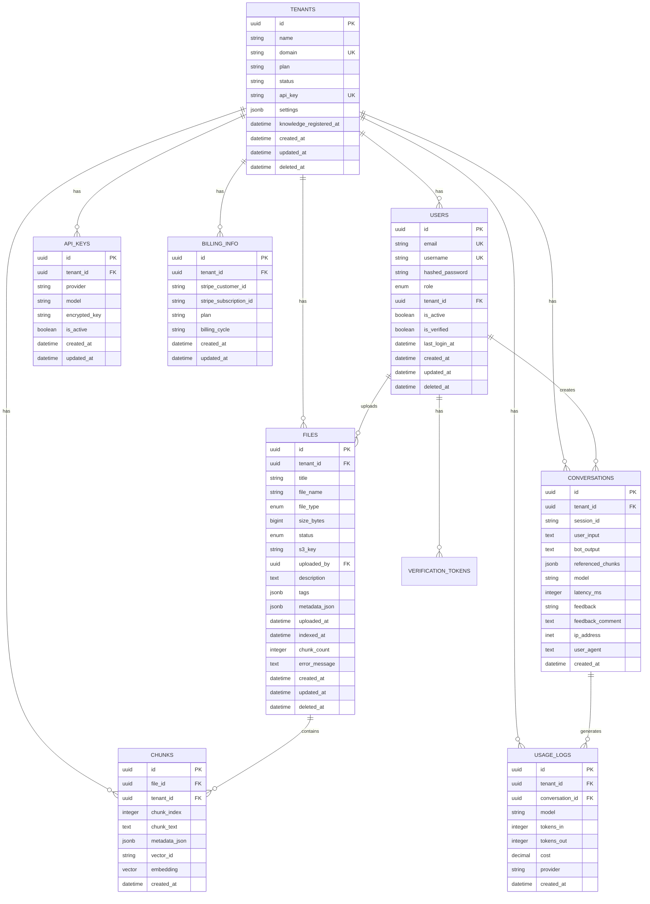

# データベース設計書

## 1. 概要

### 1.1 データベース構成
- **DBMS**: PostgreSQL 17+
- **拡張機能**: pgvector, pgcrypto, pg_trgm
- **文字コード**: UTF-8
- **タイムゾーン**: Asia/Tokyo

### 1.2 設計方針
- マルチテナント対応（テナントIDによる論理分離）
- ソフトデリート対応（`deleted_at`カラム）
- タイムスタンプ自動管理（`created_at`, `updated_at`）
- UUIDを主キーとして使用

---

## 2. ER図

---

## 3. テーブル定義

### 3.1 tenants（テナント）

| カラム名 | データ型 | 制約 | 説明 |
|---|---|---|---|
| id | UUID | PK | テナントID |
| name | VARCHAR(255) | NOT NULL | テナント名 |
| domain | VARCHAR(255) | NOT NULL, UNIQUE | ドメイン名 |
| plan | VARCHAR(50) | NOT NULL, DEFAULT 'FREE' | プラン種別 |
| status | VARCHAR(50) | NOT NULL, DEFAULT 'ACTIVE' | ステータス |
| api_key | VARCHAR(255) | NOT NULL, UNIQUE | APIキー |
| settings | JSONB | NOT NULL, DEFAULT '{}' | 設定情報 |
| knowledge_registered_at | TIMESTAMP WITH TIME ZONE | NULL | 初回ナレッジ登録日時 |
| created_at | TIMESTAMP WITH TIME ZONE | NOT NULL | 作成日時 |
| updated_at | TIMESTAMP WITH TIME ZONE | NOT NULL | 更新日時 |
| deleted_at | TIMESTAMP WITH TIME ZONE | NULL | 削除日時 |

**インデックス**:
- `idx_tenants_domain`: `domain`
- `idx_tenants_status`: `status`

### 3.2 users（ユーザー）

| カラム名 | データ型 | 制約 | 説明 |
|---|---|---|---|
| id | UUID | PK | ユーザーID |
| email | VARCHAR(255) | NOT NULL, UNIQUE | メールアドレス |
| username | VARCHAR(100) | NOT NULL, UNIQUE | ユーザー名 |
| hashed_password | VARCHAR(255) | NOT NULL | ハッシュ化パスワード |
| role | ENUM | NOT NULL, DEFAULT 'OPERATOR' | ロール |
| tenant_id | UUID | FK → tenants.id | テナントID |
| is_active | BOOLEAN | DEFAULT TRUE | アクティブ状態 |
| is_verified | BOOLEAN | DEFAULT FALSE | 認証済み |
| last_login_at | TIMESTAMP WITH TIME ZONE | NULL | 最終ログイン日時 |
| created_at | TIMESTAMP WITH TIME ZONE | NOT NULL | 作成日時 |
| updated_at | TIMESTAMP WITH TIME ZONE | NOT NULL | 更新日時 |
| deleted_at | TIMESTAMP WITH TIME ZONE | NULL | 削除日時 |

**インデックス**:
- `idx_users_email`: `email`
- `idx_users_username`: `username`
- `idx_users_tenant_id`: `tenant_id`

### 3.3 files（ファイル）

| カラム名 | データ型 | 制約 | 説明 |
|---|---|---|---|
| id | UUID | PK | ファイルID |
| tenant_id | UUID | FK → tenants.id | テナントID |
| title | VARCHAR(255) | NOT NULL | タイトル |
| file_name | VARCHAR(500) | NOT NULL | ファイル名 |
| file_type | ENUM | NOT NULL | ファイル形式 |
| size_bytes | BIGINT | NOT NULL | ファイルサイズ |
| status | ENUM | NOT NULL, DEFAULT 'UPLOADED' | ステータス |
| s3_key | VARCHAR(1000) | NOT NULL | ストレージキー |
| uploaded_by | UUID | FK → users.id | アップロード者 |
| description | TEXT | NULL | 説明 |
| tags | JSONB | NOT NULL, DEFAULT '[]' | タグ |
| metadata_json | JSONB | NOT NULL, DEFAULT '{}' | メタデータ |
| uploaded_at | TIMESTAMP WITH TIME ZONE | NOT NULL | アップロード日時 |
| indexed_at | TIMESTAMP WITH TIME ZONE | NULL | インデックス化日時 |
| chunk_count | INTEGER | NULL | チャンク数 |
| error_message | TEXT | NULL | エラーメッセージ |
| created_at | TIMESTAMP WITH TIME ZONE | NOT NULL | 作成日時 |
| updated_at | TIMESTAMP WITH TIME ZONE | NOT NULL | 更新日時 |
| deleted_at | TIMESTAMP WITH TIME ZONE | NULL | 削除日時 |

**インデックス**:
- `idx_files_tenant_id`: `tenant_id`
- `idx_files_status`: `status`
- `idx_files_file_type`: `file_type`

### 3.4 chunks（チャンク）

| カラム名 | データ型 | 制約 | 説明 |
|---|---|---|---|
| id | UUID | PK | チャンクID |
| file_id | UUID | FK → files.id | ファイルID |
| tenant_id | UUID | FK → tenants.id | テナントID |
| chunk_index | INTEGER | NOT NULL | チャンクインデックス |
| chunk_text | TEXT | NOT NULL | チャンクテキスト |
| metadata_json | JSONB | NOT NULL, DEFAULT '{}' | メタデータ |
| vector_id | VARCHAR(255) | NULL | ベクトルDB ID |
| embedding | VECTOR(1536) | NULL | 埋め込みベクトル |
| created_at | TIMESTAMP WITH TIME ZONE | NOT NULL | 作成日時 |

**インデックス**:
- `idx_chunks_file_id`: `file_id`
- `idx_chunks_tenant_id`: `tenant_id`
- `idx_chunks_embedding_hnsw`: `embedding` (HNSW)
- `UNIQUE(file_id, chunk_index)`: ファイル内でのチャンクインデックスの一意性

### 3.5 conversations（会話履歴）

| カラム名 | データ型 | 制約 | 説明 |
|---|---|---|---|
| id | UUID | PK | 会話ID |
| tenant_id | UUID | NOT NULL | テナントID |
| session_id | VARCHAR(255) | NOT NULL | セッションID |
| user_input | TEXT | NOT NULL | ユーザー入力 |
| bot_output | TEXT | NOT NULL | ボット応答 |
| referenced_chunks | JSONB | NOT NULL, DEFAULT '[]' | 参照チャンク |
| model | VARCHAR(100) | NOT NULL | 使用モデル |
| latency_ms | INTEGER | NULL | レイテンシ（ミリ秒） |
| feedback | VARCHAR(50) | NULL | フィードバック |
| feedback_comment | TEXT | NULL | フィードバックコメント |
| ip_address | INET | NULL | IPアドレス |
| user_agent | TEXT | NULL | ユーザーエージェント |
| created_at | TIMESTAMP WITH TIME ZONE | NOT NULL | 作成日時 |

**インデックス**:
- `idx_conversations_tenant_id`: `tenant_id`
- `idx_conversations_session_id`: `session_id`
- `idx_conversations_created_at`: `created_at`

### 3.6 api_keys（APIキー）

| カラム名 | データ型 | 制約 | 説明 |
|---|---|---|---|
| id | UUID | PK | APIキーID |
| tenant_id | UUID | FK → tenants.id | テナントID |
| provider | VARCHAR(50) | NOT NULL | プロバイダー |
| model | VARCHAR(100) | NOT NULL | モデル名 |
| encrypted_key | TEXT | NOT NULL | 暗号化されたAPIキー |
| is_active | BOOLEAN | DEFAULT TRUE | アクティブ状態 |
| created_at | TIMESTAMP WITH TIME ZONE | NOT NULL | 作成日時 |
| updated_at | TIMESTAMP WITH TIME ZONE | NOT NULL | 更新日時 |

**インデックス**:
- `idx_api_keys_tenant_id`: `tenant_id`
- `idx_api_keys_provider`: `provider`

### 3.7 usage_logs（使用量ログ）

| カラム名 | データ型 | 制約 | 説明 |
|---|---|---|---|
| id | UUID | PK | ログID |
| tenant_id | UUID | FK → tenants.id | テナントID |
| conversation_id | UUID | FK → conversations.id | 会話ID |
| model | VARCHAR(100) | NOT NULL | 使用モデル |
| tokens_in | INTEGER | NOT NULL | 入力トークン数 |
| tokens_out | INTEGER | NOT NULL | 出力トークン数 |
| cost | DECIMAL(10, 4) | NOT NULL | コスト |
| provider | VARCHAR(50) | NOT NULL | プロバイダー |
| created_at | TIMESTAMP WITH TIME ZONE | NOT NULL | 作成日時 |

**インデックス**:
- `idx_usage_logs_tenant_id`: `tenant_id`
- `idx_usage_logs_conversation_id`: `conversation_id`
- `idx_usage_logs_created_at`: `created_at`

### 3.8 billing_info（課金情報）

| カラム名 | データ型 | 制約 | 説明 |
|---|---|---|---|
| id | UUID | PK | 課金情報ID |
| tenant_id | UUID | FK → tenants.id | テナントID |
| stripe_customer_id | VARCHAR(255) | NULL | Stripe顧客ID |
| stripe_subscription_id | VARCHAR(255) | NULL | StripeサブスクリプションID |
| plan | VARCHAR(50) | NOT NULL | プラン |
| billing_cycle | VARCHAR(50) | NOT NULL | 課金サイクル |
| created_at | TIMESTAMP WITH TIME ZONE | NOT NULL | 作成日時 |
| updated_at | TIMESTAMP WITH TIME ZONE | NOT NULL | 更新日時 |

**インデックス**:
- `idx_billing_info_tenant_id`: `tenant_id`
- `idx_billing_info_stripe_customer_id`: `stripe_customer_id`

---

## 4. リレーションシップ

### 4.1 外部キー制約

- `users.tenant_id` → `tenants.id`
- `files.tenant_id` → `tenants.id`
- `files.uploaded_by` → `users.id`
- `chunks.file_id` → `files.id` (CASCADE DELETE)
- `chunks.tenant_id` → `tenants.id` (CASCADE DELETE)
- `conversations.tenant_id` → `tenants.id`
- `api_keys.tenant_id` → `tenants.id`
- `usage_logs.tenant_id` → `tenants.id`
- `usage_logs.conversation_id` → `conversations.id`
- `billing_info.tenant_id` → `tenants.id`

### 4.2 カスケード削除

- テナント削除時: 関連するすべてのデータを削除
- ファイル削除時: 関連するチャンクを削除

---

## 5. インデックス戦略

### 5.1 プライマリキー
すべてのテーブルでUUIDをプライマリキーとして使用

### 5.2 ユニーク制約
- `tenants.domain`: ドメイン名の一意性
- `tenants.api_key`: APIキーの一意性
- `users.email`: メールアドレスの一意性
- `users.username`: ユーザー名の一意性
- `chunks(file_id, chunk_index)`: ファイル内でのチャンクインデックスの一意性

### 5.3 ベクトル検索インデックス
- `chunks.embedding`: HNSWインデックス（高速ベクトル検索用）

### 5.4 テナント分離インデックス
すべてのテナント関連テーブルに `tenant_id` のインデックスを作成

---

## 6. データ型定義

### 6.1 ENUM型

#### UserRole
- `PLATFORM_ADMIN`
- `ADMIN`
- `OPERATOR`
- `USER`
- `AUDITOR`

#### FileType
- `PDF`
- `TXT`
- `DOCX`

#### FileStatus
- `UPLOADED`
- `PROCESSING`
- `COMPLETED`
- `FAILED`

---

## 7. パフォーマンス最適化

### 7.1 パーティショニング
将来実装予定: `conversations`, `usage_logs` を日付でパーティショニング

### 7.2 アーカイブ
古いデータをアーカイブテーブルに移動（将来実装予定）

---

**作成日**: 2025-01-XX  
**最終更新日**: 2025-01-XX

