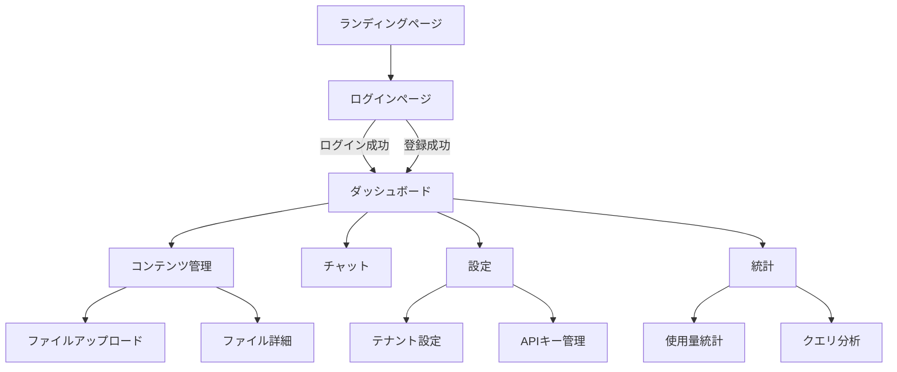

# 画面設計書

## 1. 概要

### 1.1 UI/UX設計原則
- **シンプルで直感的**: ユーザーが迷わないUI
- **レスポンシブデザイン**: モバイル・タブレット・PC対応
- **アクセシビリティ**: WCAG 2.1 AA準拠
- **一貫性**: デザインシステムに基づいた統一感

### 1.2 デザインシステム
- **フレームワーク**: Next.js 15+ / React 18+
- **UIライブラリ**: shadcn/ui
- **スタイリング**: Tailwind CSS
- **フォーム**: React Hook Form + Zod

---

## 2. 画面一覧

### 2.1 認証関連画面

#### 2.1.1 ランディングページ（/）
**目的**: サービス紹介とログイン・登録への導線

**構成要素**:
- ヘッダー（ログイン・登録ボタン）
- ヒーローセクション（サービス紹介）
- 機能紹介セクション
- 使い方セクション
- 問い合わせセクション
- フッター

**画面遷移**:
- 「ログイン」ボタン → `/login`
- 「新規登録」ボタン → `/login?tab=register`
- ログイン済みユーザー → `/dashboard`（自動リダイレクト）

#### 2.1.2 ログインページ（/login）
**目的**: ユーザー認証

**構成要素**:
- タブ切り替え（ログイン / 新規登録）
- ログインフォーム:
  - メールアドレス入力
  - パスワード入力
  - 「ログイン」ボタン
- 登録フォーム:
  - メールアドレス入力
  - ユーザー名入力
  - パスワード入力
  - パスワード確認入力
  - テナント名入力
  - テナントドメイン入力
  - 「登録」ボタン
- エラーメッセージ表示

**画面遷移**:
- ログイン成功 → `/dashboard`
- 登録成功 → `/dashboard`
- ログイン済みユーザー → `/dashboard`（自動リダイレクト）

### 2.2 メイン画面

#### 2.2.1 ダッシュボード（/dashboard）
**目的**: システム全体の状況を一覧表示

**構成要素**:
- サイドバー（ナビゲーション）
- ヘッダー（ユーザー情報、ログアウト）
- 統計カード:
  - 総ユーザー数
  - 総テナント数
  - アクティブテナント数
  - 総コンテンツ数
  - 総質問数
  - アクティブユーザー数
- システム状況:
  - コンテンツ状況（インデックス済み、処理中、失敗）
  - テナント状況
  - 設定状況（APIキー、モデル設定）
- 最近の活動履歴
- クイックアクション:
  - ファイルアップロード
  - チャット開始
  - 設定

**権限別表示**:
- **PLATFORM_ADMIN**: 全統計表示
- **ADMIN**: テナント内統計表示
- **OPERATOR**: 基本統計表示

#### 2.2.2 コンテンツ管理画面（/contents）
**目的**: ファイルの管理

**構成要素**:
- ファイル一覧テーブル:
  - ファイル名
  - ファイル形式
  - ステータス
  - ファイルサイズ
  - アップロード日時
  - アクション（削除、詳細）
- 検索・フィルタ:
  - ファイル形式フィルタ
  - ステータスフィルタ
  - 検索キーワード
- アップロードボタン
- アップロードモーダル:
  - ファイル選択
  - タイトル入力
  - 説明入力
  - タグ入力
  - 「アップロード」ボタン

**画面遷移**:
- 「アップロード」ボタン → アップロードモーダル表示
- ファイル選択 → ファイル詳細モーダル（将来実装）

#### 2.2.3 チャット画面（/chat）
**目的**: RAGチャットの実行

**構成要素**:
- チャットエリア:
  - メッセージリスト（ユーザー / ボット）
  - 入力欄
  - 「送信」ボタン
- 設定パネル:
  - モデル選択
  - Top K設定
  - Temperature設定
- ソース表示:
  - 使用されたチャンクのファイル名
  - チャンクテキストの一部

**機能**:
- 会話履歴の保持
- ストリーミング応答（将来実装）
- フィードバック機能（いいね / 悪い）

#### 2.2.4 テナント設定画面（/settings/tenant）
**目的**: テナント設定の管理

**構成要素**:
- 基本情報:
  - テナント名
  - ドメイン
  - プラン
  - ステータス
- 設定:
  - 埋め込みモデル選択
  - LLMモデル選択
- 埋め込みコード:
  - 埋め込みコード表示
  - コピーボタン
- 「保存」ボタン

**権限**: ADMIN以上

#### 2.2.5 APIキー管理画面（/settings/api-keys）
**目的**: AI APIキーの管理

**構成要素**:
- APIキー一覧テーブル:
  - プロバイダー
  - モデル
  - ステータス
  - 作成日時
  - アクション（削除）
- 「新規追加」ボタン
- 追加モーダル:
  - プロバイダー選択
  - モデル選択
  - APIキー入力
  - 「登録」ボタン

**権限**: ADMIN以上

#### 2.2.6 統計画面（/stats）
**目的**: 使用量統計の表示

**構成要素**:
- 期間選択:
  - 開始日
  - 終了日
  - 集計粒度（日次、週次、月次）
- 統計グラフ:
  - トークン使用量
  - コスト
  - リクエスト数
- 統計テーブル:
  - 日付別の詳細

**権限**: OPERATOR以上

#### 2.2.7 クエリ分析画面（/analytics/queries）
**目的**: よくある質問の分析

**構成要素**:
- クエリクラスタ一覧:
  - クラスタ名
  - 質問数
  - 平均応答時間
  - 評価率
- 期間選択
- 言語選択

**権限**: OPERATOR以上

---

## 3. 画面遷移図

---

## 4. UIコンポーネント設計

### 4.1 共通コンポーネント

#### 4.1.1 ヘッダー
- ロゴ
- ナビゲーションメニュー
- ユーザー情報
- ログアウトボタン

#### 4.1.2 サイドバー
- メニュー項目:
  - ダッシュボード
  - コンテンツ管理
  - チャット
  - 設定
  - 統計
- 折りたたみ機能

#### 4.1.3 フッター
- コピーライト
- リンク

### 4.2 フォームコンポーネント

#### 4.2.1 入力フィールド
- ラベル
- 入力欄
- エラーメッセージ
- ヘルプテキスト

#### 4.2.2 ボタン
- プライマリボタン
- セカンダリボタン
- 危険ボタン（削除等）

#### 4.2.3 モーダル
- タイトル
- コンテンツ
- アクションボタン
- 閉じるボタン

### 4.3 データ表示コンポーネント

#### 4.3.1 テーブル
- ソート機能
- ページネーション
- フィルタ機能

#### 4.3.2 カード
- タイトル
- コンテンツ
- アクション

#### 4.3.3 グラフ
- 折れ線グラフ
- 棒グラフ
- 円グラフ

---

## 5. レスポンシブデザイン

### 5.1 ブレークポイント

- **モバイル**: < 640px
- **タブレット**: 640px - 1024px
- **デスクトップ**: > 1024px

### 5.2 レイアウト調整

- **モバイル**: サイドバーをハンバーガーメニューに変更
- **タブレット**: 2カラムレイアウト
- **デスクトップ**: 3カラムレイアウト

---

## 6. アクセシビリティ

### 6.1 キーボード操作
- Tabキーでフォーカス移動
- Enterキーで送信
- Escキーでモーダル閉じる

### 6.2 スクリーンリーダー対応
- ARIAラベル
- セマンティックHTML
- 適切な見出し構造

### 6.3 色のコントラスト
- WCAG 2.1 AA準拠（コントラスト比4.5:1以上）

---

## 7. エラーハンドリング

### 7.1 エラー表示
- トースト通知
- インラインメッセージ
- エラーページ

### 7.2 ローディング表示
- スピナー
- スケルトンローディング
- プログレスバー

---

**作成日**: 2025-01-XX  
**最終更新日**: 2025-01-XX

