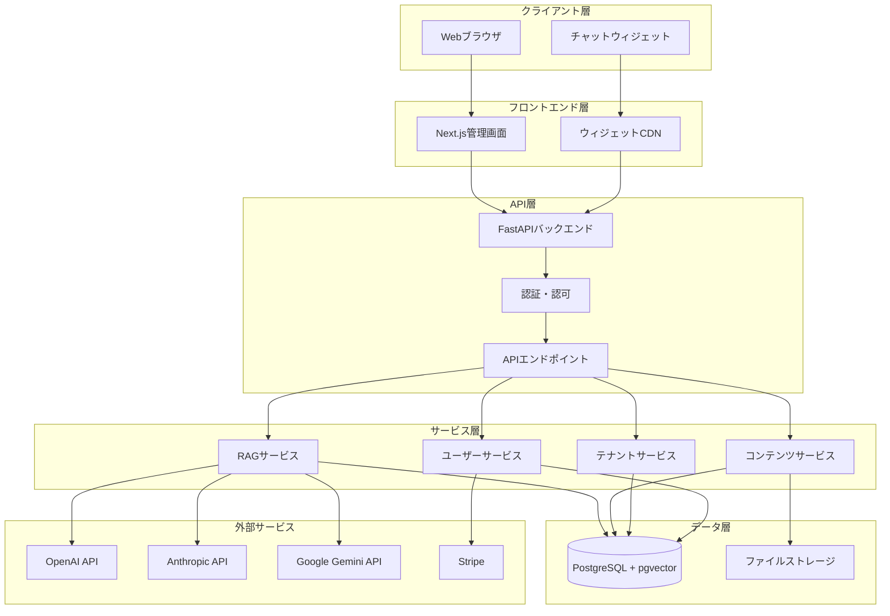
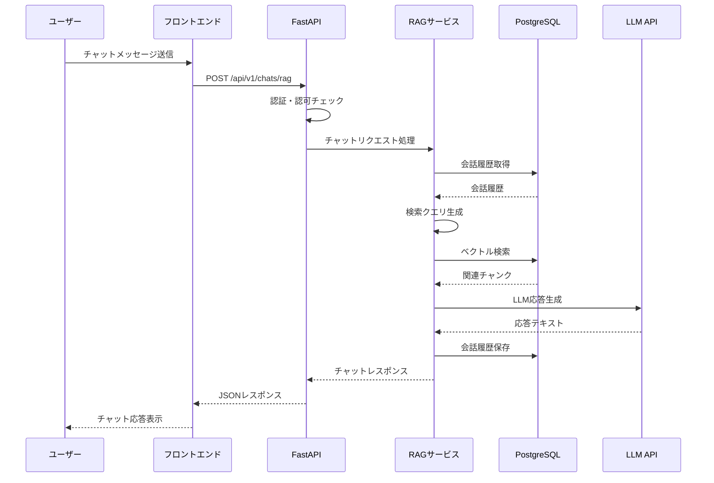
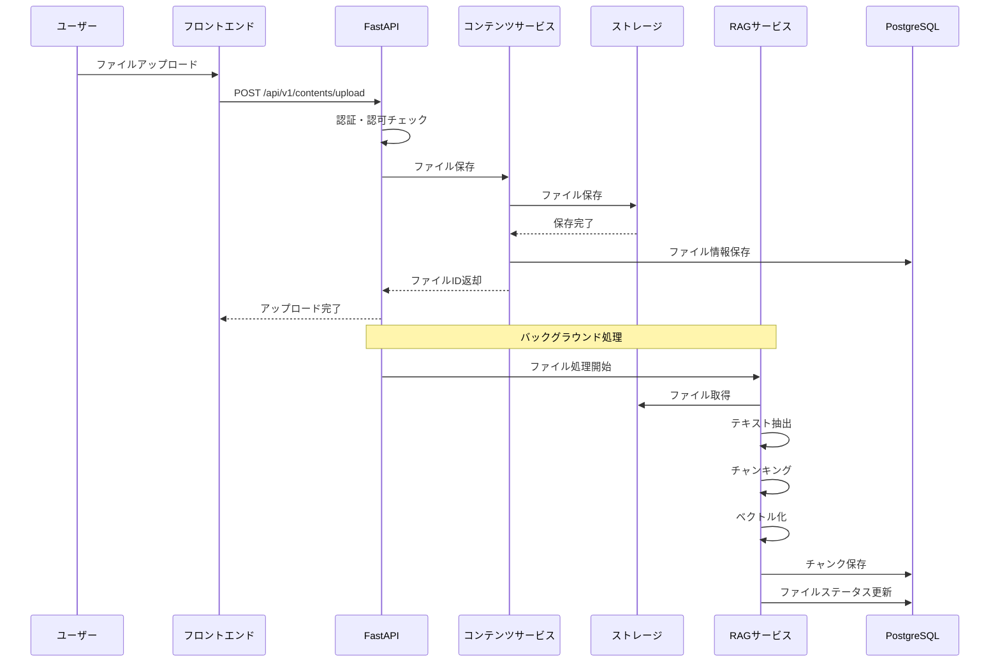
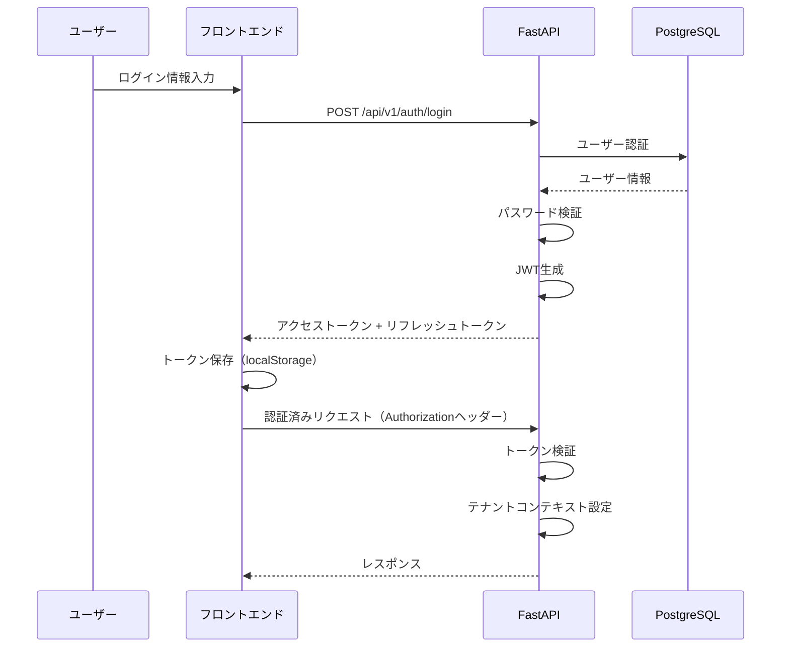

# システムアーキテクチャ

本ドキュメントでは、RAG AIプラットフォームのシステムアーキテクチャの全体像を説明します。

## 目次

- [アーキテクチャ概要](#アーキテクチャ概要)
- [システム構成](#システム構成)
- [コンポーネント詳細](#コンポーネント詳細)
- [データフロー](#データフロー)
- [マルチテナント設計](#マルチテナント設計)
- [セキュリティアーキテクチャ](#セキュリティアーキテクチャ)
- [スケーラビリティ](#スケーラビリティ)

---

## アーキテクチャ概要

RAG AIプラットフォームは、マイクロサービス志向のアーキテクチャを採用し、以下の原則に基づいて設計されています：

- **マイクロサービス志向**: 疎結合な機能分割
- **マルチテナント**: データ・リソース分離
- **スケーラビリティ**: 水平スケール可能
- **セキュリティファースト**: 多層防御
- **可観測性**: 監視・ログ・トレース

### 技術スタック

- **フロントエンド**: Next.js 15+, React 18+, TypeScript 5.2+
- **バックエンド**: Python 3.11+, FastAPI
- **データベース**: PostgreSQL 17+ with pgvector
- **キャッシュ**: Redis（将来実装予定）
- **ストレージ**: ローカルファイルシステム / Vercel Blob Storage
- **AI/ML**: LangChain, OpenAI, Anthropic, Google Gemini

---

## システム構成

### 全体アーキテクチャ図



### レイヤー構成

```
┌─────────────────────────────────────────┐
│  クライアント層                          │
│  - Webブラウザ                           │
│  - チャットウィジェット                  │
└─────────────────────────────────────────┘
                    ↓
┌─────────────────────────────────────────┐
│  フロントエンド層                        │
│  - Next.js管理画面                       │
│  - ウィジェットCDN                       │
└─────────────────────────────────────────┘
                    ↓
┌─────────────────────────────────────────┐
│  API層                                   │
│  - FastAPI                               │
│  - 認証・認可ミドルウェア                │
│  - APIエンドポイント                     │
└─────────────────────────────────────────┘
                    ↓
┌─────────────────────────────────────────┐
│  サービス層                              │
│  - RAGサービス                           │
│  - コンテンツサービス                    │
│  - テナントサービス                     │
│  - ユーザーサービス                     │
└─────────────────────────────────────────┘
                    ↓
┌─────────────────────────────────────────┐
│  データ層                                │
│  - PostgreSQL + pgvector                 │
│  - ファイルストレージ                   │
└─────────────────────────────────────────┘
```

---

## コンポーネント詳細

### 1. フロントエンド層

#### Next.js管理画面

- **役割**: テナント管理、コンテンツ管理、ユーザー管理、統計表示
- **技術**: Next.js 15, React 18, TypeScript, Tailwind CSS, shadcn/ui
- **主要機能**:
  - 認証・認可（JWT）
  - ダッシュボード
  - コンテンツアップロード・管理
  - テナント設定
  - 使用量統計

#### ウィジェットCDN

- **役割**: チャットウィジェットの配信
- **技術**: Node.js, Express（またはNext.js）
- **主要機能**:
  - ウィジェットJavaScriptの配信
  - バージョン管理
  - CDN最適化

### 2. API層

#### FastAPIバックエンド

- **役割**: RESTful APIの提供、ビジネスロジックの実行
- **技術**: FastAPI, Python 3.11+, Pydantic, SQLAlchemy
- **主要機能**:
  - 認証・認可（JWT + OAuth2）
  - APIエンドポイント（認証、チャット、テナント、コンテンツ等）
  - リクエストバリデーション
  - エラーハンドリング
  - ログ出力

#### 認証・認可ミドルウェア

- **役割**: リクエストの認証・認可チェック
- **技術**: JWT, OAuth2, RBAC
- **主要機能**:
  - トークン検証
  - ロールベースアクセス制御
  - テナントコンテキスト設定

### 3. サービス層

#### RAGサービス

- **役割**: RAGパイプラインの実行
- **技術**: LangChain, OpenAI, Anthropic, Google Gemini
- **主要機能**:
  - 文書のベクトル化
  - ベクトル検索
  - LLM応答生成
  - 会話履歴管理

#### コンテンツサービス

- **役割**: ファイルアップロード・管理
- **技術**: ファイルシステム / Vercel Blob Storage
- **主要機能**:
  - ファイルアップロード
  - テキスト抽出
  - チャンキング
  - ベクトル化

#### テナントサービス

- **役割**: テナント管理
- **技術**: SQLAlchemy, PostgreSQL
- **主要機能**:
  - テナント作成・更新・削除
  - テナント設定管理
  - 埋め込みコード生成

#### ユーザーサービス

- **役割**: ユーザー管理、認証
- **技術**: JWT, bcrypt, SQLAlchemy
- **主要機能**:
  - ユーザー登録・認証
  - パスワード管理
  - ロール管理

### 4. データ層

#### PostgreSQL + pgvector

- **役割**: リレーショナルデータとベクトルデータの保存
- **技術**: PostgreSQL 17+, pgvector拡張
- **主要テーブル**:
  - `tenants`: テナント情報
  - `users`: ユーザー情報
  - `files`: ファイル情報
  - `chunks`: チャンク情報（ベクトル含む）
  - `conversations`: 会話履歴
  - `api_keys`: AI APIキー
  - `usage_logs`: 使用量ログ

#### ファイルストレージ

- **役割**: アップロードファイルの保存
- **技術**: ローカルファイルシステム / Vercel Blob Storage
- **主要機能**:
  - ファイル保存
  - ファイル取得
  - ファイル削除

---

## データフロー

### RAGチャットのデータフロー



### ファイルアップロードのデータフロー



---

## マルチテナント設計

### テナント分離戦略

本プラットフォームは、**論理分離（Logical Isolation）** を採用しています。

#### データ分離方法

1. **テナントIDによる分離**
   - すべてのテナント関連データに `tenant_id` カラムを設定
   - クエリ時に必ず `tenant_id` でフィルタリング

2. **Row Level Security (RLS)**
   - PostgreSQLのRLS機能を使用（将来実装予定）
   - セッションコンテキストでテナントIDを設定
   - 自動的にテナントデータのみアクセス可能

3. **アプリケーションレベルでの分離**
   - すべてのリポジトリで `tenant_id` を必須パラメータとして受け取る
   - サービス層でテナントコンテキストを管理

#### テナントコンテキスト設定

```python
# リポジトリでのテナントコンテキスト設定
async def set_tenant_context(self, tenant_id: str) -> None:
    """Set current tenant id for RLS policies."""
    await self.session.execute(
        text("SELECT set_config('app.tenant_id', :tenant_id, false)")
        .bindparams(tenant_id=tenant_id)
    )
```

#### テナント関連テーブル

- `tenants`: テナント基本情報
- `users`: ユーザー（`tenant_id` で関連付け）
- `files`: ファイル（`tenant_id` で関連付け）
- `chunks`: チャンク（`tenant_id` で関連付け）
- `conversations`: 会話履歴（`tenant_id` で関連付け）
- `api_keys`: APIキー（`tenant_id` で関連付け）

### ベクトルDBの分離

- **論理分離（デフォルト）**: すべてのテナントが同じインデックスを使用し、メタデータで分離
- **物理分離（オプション）**: テナント毎に別々のインデックスを作成（`VECTORDB_PHYSICAL_ISOLATION=true`）

---

## セキュリティアーキテクチャ

### 多層防御

```
┌─────────────────────────────────────────┐
│  レイヤー1: ネットワーク層               │
│  - HTTPS/TLS                             │
│  - CORS設定                              │
└─────────────────────────────────────────┘
                    ↓
┌─────────────────────────────────────────┐
│  レイヤー2: 認証・認可層                 │
│  - JWT認証                               │
│  - OAuth2                                │
│  - RBAC                                  │
└─────────────────────────────────────────┘
                    ↓
┌─────────────────────────────────────────┐
│  レイヤー3: アプリケーション層           │
│  - 入力バリデーション                      │
│  - SQLインジェクション対策                │
│  - XSS対策                               │
│  - CSRF対策                              │
└─────────────────────────────────────────┘
                    ↓
┌─────────────────────────────────────────┐
│  レイヤー4: データ層                     │
│  - テナント分離                          │
│  - パスワードハッシュ化                  │
│  - 暗号化                                │
└─────────────────────────────────────────┘
```

### 認証フロー



### 認可（RBAC）

- **Platform Admin**: プラットフォーム全体の管理
- **Admin**: テナント内の全権限
- **Operator**: コンテンツ管理、チャット実行
- **User**: チャット実行のみ
- **Auditor**: 閲覧のみ

---

## スケーラビリティ

### 水平スケーリング

- **フロントエンド**: Vercelの自動スケーリング
- **バックエンド**: 複数のFastAPIインスタンスをロードバランサーで分散
- **データベース**: 読み取りレプリカによる負荷分散（将来実装予定）

### キャッシュ戦略

- **Redis**: セッション管理、頻繁にアクセスされるデータのキャッシュ（将来実装予定）
- **CDN**: ウィジェット配信の最適化

### 非同期処理

- **バックグラウンドタスク**: ファイル処理を非同期で実行
- **FastAPI BackgroundTasks**: レスポンス返却後の処理

---

## 監視・可観測性

### ログ

- **構造化ログ**: JSON形式で出力
- **ログレベル**: ERROR, WARN, INFO, DEBUG
- **ログ出力先**: 標準出力（将来はCloudWatch等に送信）

### メトリクス

- **Prometheus形式**: メトリクス収集（将来実装予定）
- **監視項目**: リクエスト数、レスポンス時間、エラー率、データベース接続数

### トレーシング

- **OpenTelemetry**: 分散トレーシング（将来実装予定）
- **トレース項目**: リクエストフロー、外部API呼び出し、データベースクエリ

---

## 今後の拡張予定

- Redis統合（キャッシュ・セッション管理）
- Row Level Security (RLS) の完全実装
- 読み取りレプリカによる負荷分散
- メトリクス・トレーシングの実装
- マイクロサービス化の推進

---

**最終更新日**: 2025-01-XX

